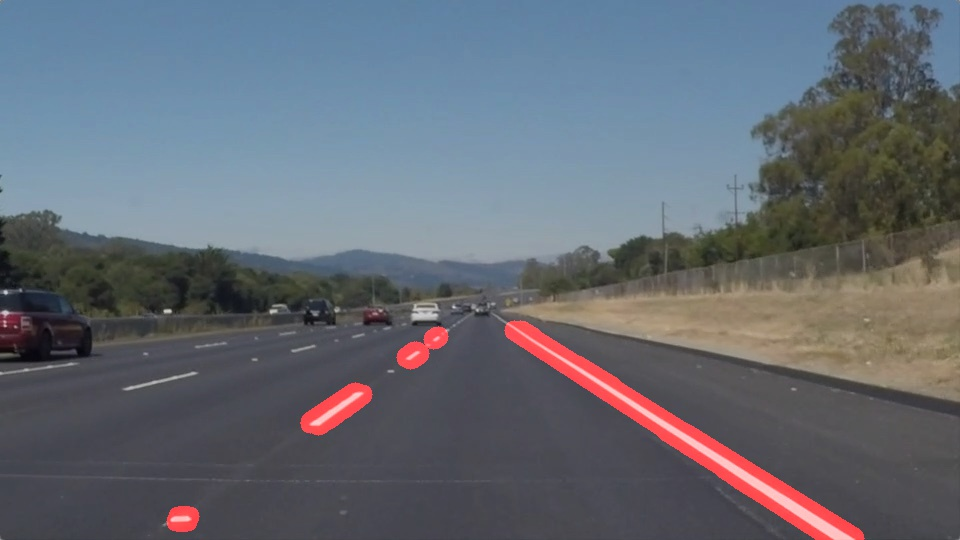

# **Finding Lane Lines on the Road** 

Overview
---

This project represents one of the first steps in developing a self-driving car: to automatically detect lane lines using an algorithm. This project uses Python and OpenCV to detect lane lines in images.

The project consistes of two key files which describe the project in detail:
1. A file containing project code ([Project.ipynb](https://github.com/iammsg/Project1/blob/master/Project.ipynb)): This python notebook goes into the guts of the algorithm we have devised to describe how we are able to use Canny Edge Detection and the Hough transfrom to define lane lines.
2. A writeup that decribes the proposed solution ([Writeup.md](https://github.com/iammsg/Project1/blob/master/Writeup.md)): This markdown file describes the pipele in detail, identifies some of the key shortcomings and wraps up with a few possible improvements.

These were created in accordance to the [project rubric](https://review.udacity.com/#!/rubrics/322/view)