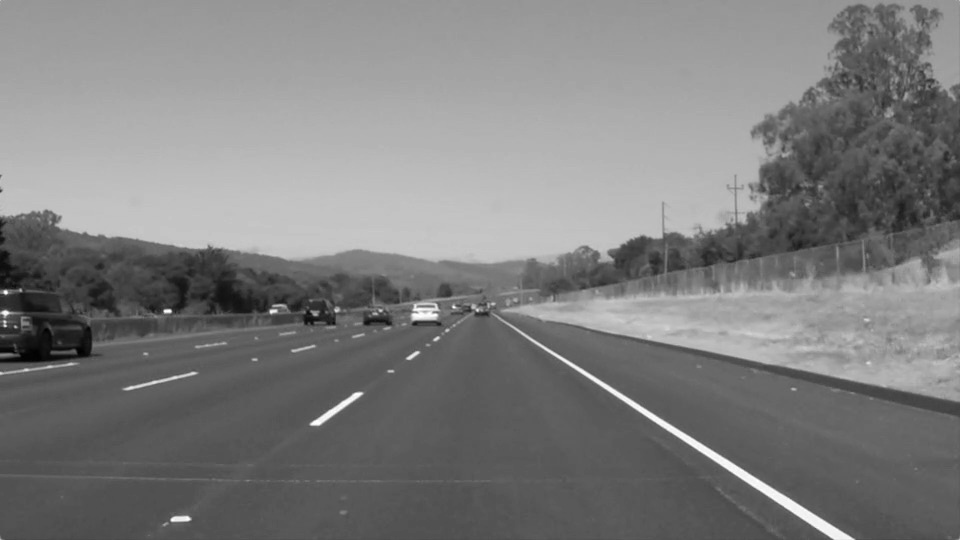

## **Finding Lane Lines on the Road** 

---

**Finding Lane Lines on the Road**

The goals / steps of this project are the following:
* Make a pipeline that finds lane lines on the road
* Reflect on your work in a written report

---

### Reflection

### 1. Describe your pipeline. As part of the description, explain how you modified the draw_lines() function.

My pipeline consisted of the following 5 steps. 

1. First, I converted the images to grayscale

2. These grayscale images were blurred using a Gaussian Kernel of size 5.

3. The blurred images were then run through a Canny Edge Detection algorithm using a low and high threshold of 50 and 150 respectively. These values gave the sweet spot edges required for the exercise

4. To restrict the image to just the path relevant to the car, I created a polygonal region of interest which is shown below

   This eliminates all the spurious edges not pertaining to the path in question
    
   
    
5. Finally, the masked image was utilized in a hough transform to give the final lane detections.

In order to draw a single line on the left and right lanes, I modified the draw_lines() function by including these steps:

1. ***Calculation of the slopes***: I calculated the slope of each line segment by using the simple formula of $\frac{y_2 - y_1}{x_2 - x_1}$ and the corresponding intercept by using the equation of a line i.e. $y=mx+b$

2. ***Weeding out outliers***: Next I separated the list of slopes by which lane they were from(left/right). The side was chosen by the sign of the slope; a negative slope represented a line segment on the left lane while a positive slope represented a line segment on the right line. From these lists, outliers were removed. For the purpose of this exercise, any point beyond 1$\sigma$ from the mean of slopes (positive or negative) was eliminated. The corresponding intercept points were also removed

3. ***Finding the intersection points***: Now that we have the average slope and intercept for the lines on the left and right lanes, the next step will be to determine the endpoints for each line. This was done by determining the point of intersection of both lines with the edge of the image ($y=540$) and the top edge of our region of interest: the line between $(420,330)$ \& $(525,330)$.

4. ***Drawing the lines***: Finally, now that we have all the required points, the two lines were drawn on the image using cv2.line

### 2. Identify potential shortcomings with your current pipeline

These are a few potential shortcomings

* ***Curved Roads***: The pipeline works best for straight roads as the discerning factor is the slope of the lanes. If these were varying significantly like in a curved road, the algorithm would fail.

* ***Parameter Selection***: The choice of Hough parameters are rather arbitrary which work for this condition. These values may not work for all scenarios. 

* ***Road Traffic***: Another shortcoming could be if there were significant traffic on the roads which could hinder visibility. This would mean enough correct edges wouldn't be detected by the canny algorithm.

### 3. Suggest possible improvements to your pipeline

Here are a few possible improvements:

* ***Better Statistics of Lane Detection***: A possible improvement would be to better the statistics of the lane detection. Currently the lane is fit on a frame-by-frame basis with no concept of earlier frames. For a better final product, it might be useful to keep memory of the values of slope for each frame and calculate a more robust average slope for the *entire* video rather than for individual frames.

* ***Higher level Polynomials***: Another one would be to implement fitting the line segments over higher level polynomials. This would also help in alleviating the curvature problem for the pipeline. 
